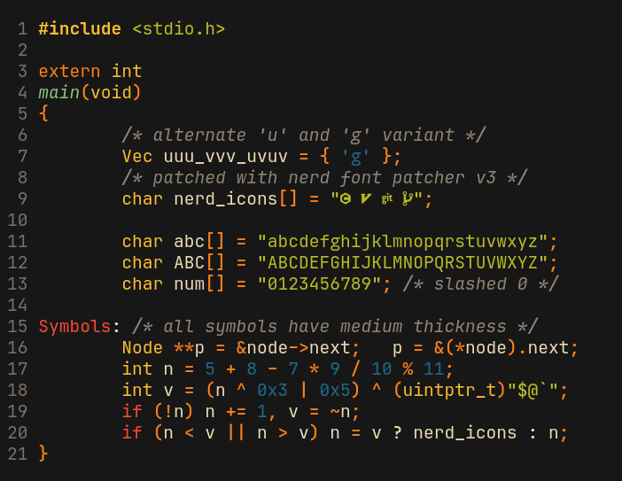

# NRK Mono

This is a modified version of [JetBrains Mono][JBM] based on `v2.304`.
***You can download the ttf files from the [releases tab][rel]
(grab the `.tar.zst` file).***

Some notable changes are:

* Patched with [Nerd-Font-Patcher][NFP] (search for `FontPatcher.zip`).
* Slashed zero instead of dotted one.
* Uses the alternate `u` with a downwards bar.
* Uses the alternate `g` with a rounded bottom.
* Uses the alternate/old `5`.
* Uses old `J` with a bar on top.
* All non-alphanumeric ascii chars have been taken from `v2.001`.
* All non-alphanumeric ascii chars have medium thickness.
* Modified `ascent/descent` to workaround the [line height issue][lineBug] (this
  may cause problems with certain glyphs).
* Additional "Condensed" variant (-6%) available to better utilize horizontal
  screen space.

[JBM]: https://github.com/JetBrains/JetBrainsMono
[NFP]: https://github.com/ryanoasis/nerd-fonts/releases/latest
[rel]: https://github.com/N-R-K/NRK-Mono/releases

## Preview

## License

Same as JetBrainsMono.

## How to extract `.tar.zst`

#### Linux/BSD/macos

0. Install the `zstd` package (if you don't have it installed already).
1. Run `tar -I zstd -xf NRK-Mono.tar.zst`.

#### Windows

If you want a GUI then [7-zip-zstd](https://github.com/mcmilk/7-Zip-zstd)
(`.exe` download [here](https://github.com/mcmilk/7-Zip-zstd/releases)) seems to
the recommended tool.

If you are comfortable with command-line, `zstd` provides official [builds for
windows](https://github.com/facebook/zstd/releases/) including a `zstd.exe`.

## Changelog v2.1.0

* The ttf files are no longer checked into the git repo
  (use the [releases tab][rel] instead).
* The font patching/building is now done through a series of scripts.
* Condensed version is back.
* Changed `g` to the googly variant.
* Patched `u` more comprehensively. The previous version only patched the ASCII
  `u` and left different variants (such as `ù`) untouched.

## Changelog v2.0.0

This update brings a lot of breaking changes:

* Updated from JetBrains Mono `v2.001` to `v2.304`.
  * The `Win {Ascent,Descent}` properties have been adjusted to workaround the
  [increased line height issue][lineBug]. This may cause problems with certain
  glyphs.
  * If the new version seems more condensed than the previous, then you might
  need to slightly increase your font size (e.g from 13 to 13.15).
  * The [`f` was reverted][f-revert] to an older version, which you might or
  might not like.
* Updated to Nerd Font v3.0.0.
  * Nerd font [v3.0.0](https://github.com/ryanoasis/nerd-fonts/releases/tag/v3.0.0)
  made a lot of breaking changes to their icon code-points. If you are missing
  icons after updating, you'll need to update your icons to the new nerd-font
  code-points.
* Dropped the "Condensed" variant.

[lineBug]: https://github.com/JetBrains/JetBrainsMono/issues/334
[f-revert]: https://github.com/JetBrains/JetBrainsMono/issues/273
