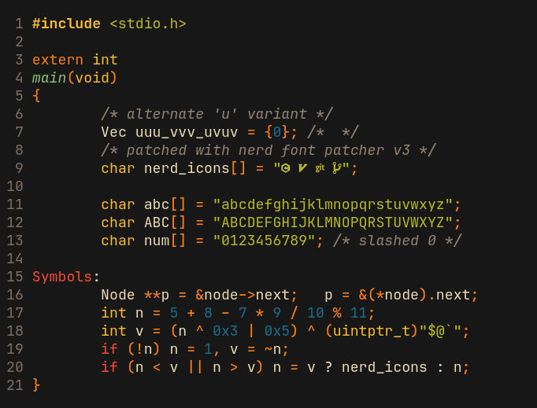

# NRK Mono

This is a modified version of [JetBrains Mono](https://github.com/JetBrains/JetBrainsMono)
based on `v2.304`.

Some notable changes are:

* Patched with [Nerd-Font-Patcher](https://github.com/ryanoasis/nerd-fonts/releases/latest) (search for `FontPatcher`).
* Slashed zero instead of dotted one.
* Uses the alternate `u` with a downwards bar.
* Uses the old `5`, `J`, `&`, `,`, `;` and `-` from `v2.001`.
* All non-alphanumeric ascii chars have medium thickness.

## Preview

## License

Same as [JetBrainsMono](https://github.com/JetBrains/JetBrainsMono/blob/master/OFL.txt).

## Changelog

The newest update brings a lot of breaking changes:

* Updated from JetBrains Mono `v2.001` to `v2.304`.
  * The `Win {Ascent,Descent}` properties have been adjusted to workaround the
  [increased line height issue][lineBug]. This may cause problems with certain
  glyphs.
  * If the new version seems more condensed than the previous, then you might
  need to slightly increase your font size (e.g from 13 to 13.15).
  * The [`f` was reverted][f-revert] to an older version, which you might or
  might not like.
* Updated to Nerd Font v3.0.0.
  * Nerd font [v3.0.0](https://github.com/ryanoasis/nerd-fonts/releases/tag/v3.0.0)
  made a lot of breaking changes to their icon code-points. If you are missing
  icons after updating, you'll need to update your icons to the new nerd-font
  code-points.
* Dropped the "Condensed" variant.

[lineBug]: https://github.com/JetBrains/JetBrainsMono/issues/334
[f-revert]: https://github.com/JetBrains/JetBrainsMono/issues/273
