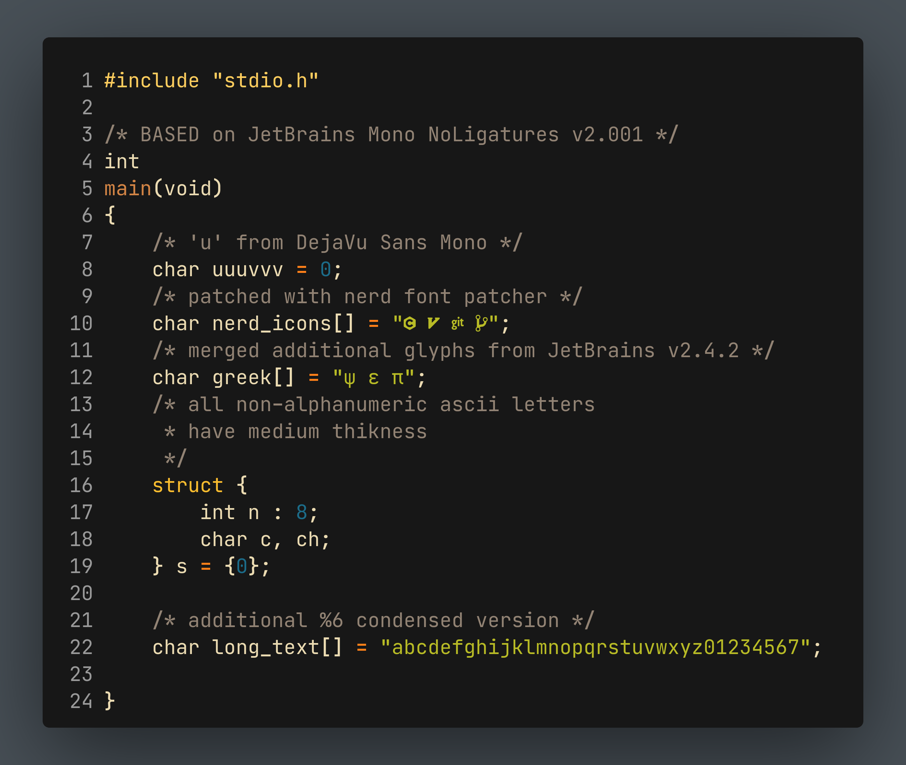

# NRK Mono

This is a modified version of [JetBrains Mono](https://github.com/JetBrains/JetBrainsMono)
based on `v2.001`.
The reason for choosing `v2.001` is because of [this issue](https://github.com/JetBrains/JetBrainsMono/issues/334).

Some notable changes are:

* Patched with [Nerd-Font-Patcher](https://github.com/N-R-K/nerd-font-patcher).
* Smaller case `u` has been replaced with `u` from DejaVu Sans Mono.
* All non-alphanumeric ascii chars have medium thickness.
* Additional `Condensed` (-6%) version for better utilizing horizontal screen space.
* Additional glyphs from `v2.242` merged in (might cause some issues).

## NRK Condensed

## NRK Mono

## License

Same as [JetBrainsMono](https://github.com/JetBrains/JetBrainsMono/blob/master/OFL.txt).
